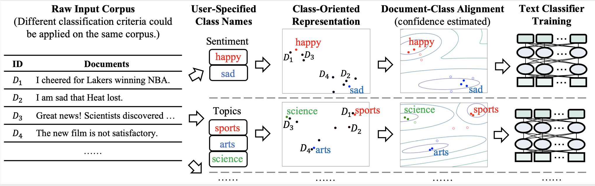

# X-Class
<h5 align="center">XClass: Text Classification with Extremely Weak Supervision</h5>

## Motivation

We propose the task: Text Classification with Extremely Weak Supervision, which is to classify documents
<<<<<<< Updated upstream
to classes, with the plain class name as the only guidance.  
Our method X-Class, breaks up this task into three modules
- Class-oriented Document Representation
    - We estimate both the class representation (based on the given class names), 
    and the document representation (guidede by the class representations).
- Document-Class Alignment
    - We apply Gaussian Mixture Models to align the document representations into clusters. The GMM is initialized with 
    a prior of every document assigned to its nearest class, and therefore, we know which cluster represents which class.
- Text Classifier Training
    - We further select the confident document-class pairs from the previous step, and train a supervised text classifier
    (e.g. BERT) above it.
This pipeline also illustrates our method.
<p align="center"></p>

## Datasets

Since many previous weakly supervised text classification problem evaluated on different datasets, we try to collect a 
unified benchmark for this problem. We try our best to cover different text source (news & reviews), and different types 
of classes (topics, sentiment, and locations). We present some statistics of them in the table below (Imbalance is the 
ratio between the largest class size and the smalles class size).

|  | AGNews | 20News | NYT-Small | NYT-Topic | NYT-Location | Yelp | DBpedia
| --- | :-------------: | :-------------: | :-------------: | :-------------: | :-------------: | :-------------: | :-------------: |
| Corpus Domain | News | News | News | News | News | Reviews | Wikipedia |
| Class Criterion | Topics | Topics | Topics | Topics | Locations | sentiment | Ontology |
| # of Classes | 4 | 5 | 5 | 9 | 10 | 2 | 14 |
| # of Documents | 120,000 | 17,871 | 13,081 | 31,997 | 31,997 | 38,000 | 560,000 |
| Imbalance | 1.0 | 2.02 | 16.65 | 27.09 | 15.84 | 1.0 | 1.0

It is worth mentioning that NYT-Topic and NYT-Location is the same underlying corpus, but annotated with two different type
of class. We defer some special handling of each dataset (e.g. mapping a class name phrase to a single word) to each 
specific dataset's folder.

## Performance 
| Models  | AGNews | 20News | NYT-Small | NYT-Topic | NYT-Location | Yelp | DBpedia
| --- | :-------------: | :-------------: | :-------------: | :-------------: | :-------------: | :-------------: | :-------------: |
| Supervised | 93.99/93.99 | 96.45/96.42 | 97.95/95.46 | 94.29/89.90 | 95.99/94.99 | 95.7/95.7 | 98.96/98.96
| [WeSTClass](https://github.com/yumeng5/WeSTClass) (+keywords) | 82.3/82.1 | 71.28/69.90 | 91.2/83.7 | 68.26/57.02 | 63.15/53.22 | 81.6/81.6 | 81.1/ N/A
| [ConWea](https://github.com/dheeraj7596/ConWea) (+keywords) | 74.6/74.2 | 75.73/73.26 | 95.23/90.79 | **81.67/71.54** | 85.31/83.81 | 71.4/71.2 | N/A 
| [LOTClass](https://github.com/yumeng5/LOTClass) | **86.89/86.82** | 73.78/72.53 | 78.12/56.05 | 67.11/43.58 | 58.49/58.96 | 87.75/87.68 | 86.66/85.98 
| X-Class | 84.8/84.65 | **81.36/80.6** | **96.67/92.98** | 80.6/69.92 | **90.5/89.81** | **88.36/88.32** | **91.33/91.14**

## Scripts
#### Environment
We used python=3.6, torch-1.4.0, cudatoolkit=10.0. 
Other packages can be installed via `pip install -r requirements.txt`.

#### Reproduce
1. Follow the guidance in `data/datasets` and download the specific dataset.
2. Create an environment, and make sure there is a gpu available. For the final BERT text classifer training step, 
around 16GB GPU memory is required. Reducing the batch size and sequence length can effectively reduce memory requirement.
3. In the scripts folder, run `./run.sh GPU_INDEX DATASET_NAME`, where `GPU_INDEX` is the index of the free gpu (e.g. 0), and
`DATASET_NAME` is the name of the dataset in `data/datasets` folder (e.g. agnews).

#### New Dataset
Our method can be easily applied to new datasets, to do that:
1. Place the new dataset in `data/datasets` folder, following the instructions.
2. Follow the reproduce steps.

#### Intermediate Data
All our intermediate data are stored in `data/intermediate_data/DATASET_NAME/`, it contains information such as
document representations, clusters, etc. 

## Citation
Please cite the following paper if you found our dataset or framework useful. Thanks!

>Zihan Wang, Dheeraj Mekala, and Jingbo Shang. "X-Class: Text Classification with Extremely Weak Supervision." arXiv preprint arXiv:2010.12794 (2020).

```
@misc{wang2020xclass,
      title={X-Class: Text Classification with Extremely Weak Supervision}, 
      author={Zihan Wang and Dheeraj Mekala and Jingbo Shang},
      year={2020},
      eprint={2010.12794},
      archivePrefix={arXiv},
      primaryClass={cs.CL}
}
```
